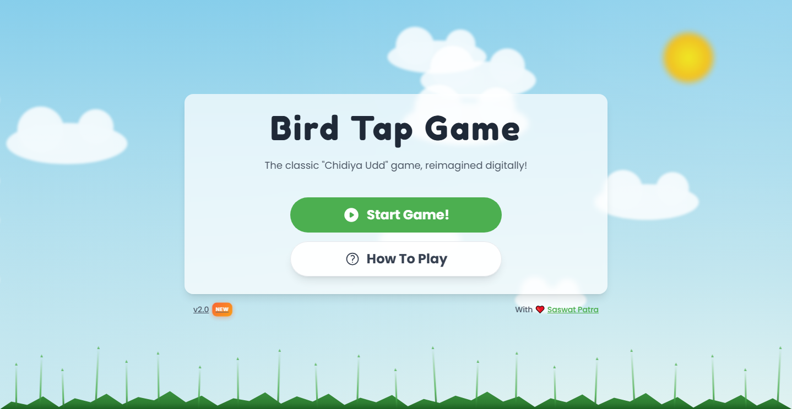

# 🐤 Bird Tap Game

The classic "Chidiya Udd" game, reimagined digitally!

🎮 Link - [birdtap.vercel.app](https://birdtap.vercel.app/)

---

## 📸 Screenshot

---

## 2️⃣ 🧠 About the Game

- **Bird Tap Game** is a digital twist on the nostalgic *“Chidiya Udd”* — the classic reflex game we all played as kids.

- Just like the childhood game, timing is everything — tap the **BIRD** button at the right moment to score points and test your reflexes!

- Built purely with **HTML, CSS, and JavaScript**, it’s lightweight, fast, and completely browser-based — no downloads, no ads, just pure fun.

---

## 3️⃣ 🎮 How to Play

- ✨ A word will appear on the screen. 
- 🐦 If it’s a bird, tap the **“BIRD!”** button.  
- 🚫 If it’s not a bird, do nothing.  
- ⏱️ You have **1 second** to react — miss it, and it’s over!  
- ⭐ Keep tapping, keep scoring — to score a high score!
  
### ⚠️ Game Over if:
- ❌ You tap on a non-bird word  
- ⏳ A bird word times out without a tap

---

## 4️⃣ ✨ Key Features

- 🎯 Simple and addictive gameplay  
- ⚡ Lightweight — runs directly in your browser  
- 🎨 Minimal, clean UI  
- 🕹️ No installations needed  

---

## 🧩 Built On | 🛠️ Tools Used
| Languages | Tools |
|------------|--------|
|   |   

---

## 6️⃣ 🤝 Contributing

Have ideas or improvements?  
Fork the repo, make changes, and open a pull request — contributions are always welcome!

---

## 8️⃣ 📄 License

🧾 MIT License — see [LICENSE](LICENSE) for details.

---

### Made with ❤️ by [Saswat Patra](https://saswatpatra.carrd.co/)

